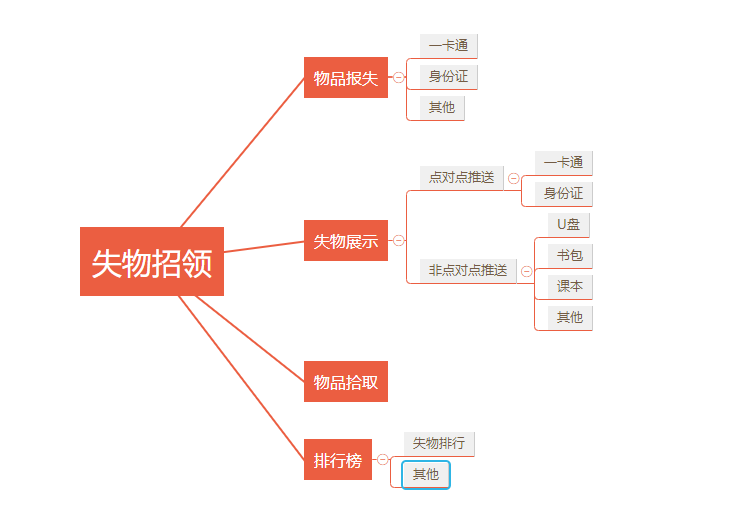
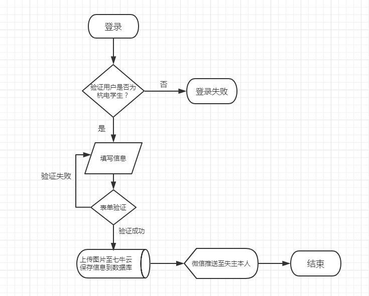

# 失物招领

本网站提供了一个平台供杭电本科在校生发布丢失的物品以及找回物品，并在移动端针对一卡通证件丢失实现了微信点对点推送服务，使用此服务的前提是必须绑定微信公众平台。

## 需求分析

在我们的大学生活中，难免会丢失一些物品，丢了东西的同学一般会发布空间说说或是找表白墙发布寻物信息，但是这样的信息是零碎化的，本网站旨在提供杭电在校学生一个集成化、系统化的平台，使失主更方便的找回失物，拾取人及时的发布拾到的失物，同时不至于出现冒领、错领等现象。失主和拾取者要求注册本平台，为保证信息的真实性，我们将使用失主和拾取者的学号和姓名作为验证和记录。

## 功能设计
- 物品报失

    失主填写失物信息，并上传图片，上传后此条报失信息将展示在失物大厅。

- 物品拾取

1. 一卡通拾取：拾取人填写失主一卡通信息（学号、姓名），并上传失主一卡通照片和个人联系方式，实现微信消息点对点推送至失主方。
2. 其他物品拾取：拾取人填写拾取物品信息，并上传照片和联系方式，上传后此拾取信息将展示在失物大厅。

- 失物展示

1. 拾取物品展示
2. 报失物品展示（寻物）
- 官网/移动端轮播图：广告位
- 失物排行：丢失最多的物品由高到低排序
- 失物招领答疑群：从浏览器跳转到QQ聊天群
- 其他功能有待开发

## 前端设计

- 移动端：
[详见墨刀设计架构](https://modao.cc/app/fhIf8OmdpqrF5APEZSNAMnCKJ6oPyXq)

- PC端：
    
    静态部分：位于页面左侧的部分设计为竖直菜单栏，属于静态部分，在页面切换时保持静态，菜单栏内容包括LOGO、首页、用户管理、物品报失、我的报失、我的拾取、失物排行榜、加入我们。
    
    动态部分：位于页面右侧的部分设计为功能页，用于显示对应于菜单栏的不同功能。
    
    [详见类似html模板](http://demo.cssmoban.com/cssthemes3/ft5_55_nitro/index.html)

- LOGO设计：
- 颜色设计：

## 技术架构
- PHP
- HTML/CSS+JS+JQ
- MySQL
- ...

## 部分流程图（持续更新）

- 一卡通推送流程图

